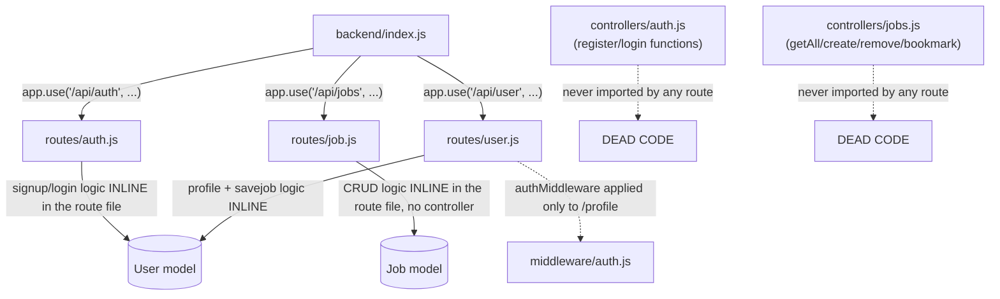
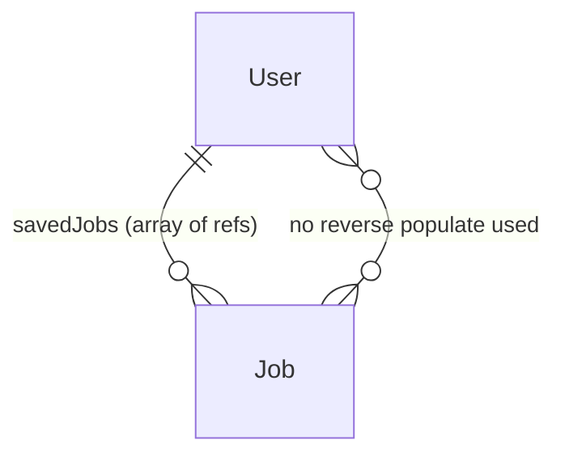

Audit date: 2026-08-13
Repository: JobPortal
Audit mode: READ-ONLY

> This report was produced by static inspection of source files, `package.json` manifests, and `git log`/`git status`. No files were modified, no dependencies were installed, no servers were started, and no database was touched. Where the live application would need to actually run to confirm a behavior (e.g. "does this screen render correctly"), that is stated explicitly as **Unknown / needs verification** rather than guessed.

---

# PART 1 — PROJECT INVENTORY

## Top-level structure

```
JobPortal/
├── .gitignore                  (ignores node_modules, .env)
├── .hintrc                     (webhint linter config, untracked)
├── backend/                    ACTIVE — Express + MongoDB API
│   ├── controllers/            partially dead code (see Part 4/5)
│   │   ├── auth.js             NOT wired to any route — dead code
│   │   └── jobs.js             NOT wired to any route — dead code
│   ├── middleware/auth.js      JWT verification middleware
│   ├── models/
│   │   ├── Job.js
│   │   └── User.js
│   ├── routes/
│   │   ├── auth.js             actual signup/login logic used by the app
│   │   ├── job.js              actual jobs CRUD used by the app
│   │   └── user.js             profile + save-job logic
│   ├── scripts/
│   │   └── importRemoteOk.js   one-off RemoteOK job importer (untracked)
│   │   └── .env                ⚠ misplaced — see Part 14
│   ├── index.js                app entry point
│   ├── package.json / package-lock.json
│   └── node_modules/           present (134 packages installed)
├── frontend/                   OBSOLETE STUB — see analysis below
│   └── src/
│       ├── App.css
│       └── App.test.js
├── frontend-vite/               ACTIVE — React 19 + Vite frontend
│   ├── src/
│   │   ├── components/          mix of used and orphaned components
│   │   ├── context/AuthContext.jsx
│   │   ├── hooks/useAuth.js
│   │   ├── pages/                13 route-level pages
│   │   ├── styles/                SCSS variables/mixins
│   │   ├── App.jsx, main.jsx, theme.js
│   ├── public/vite.svg
│   ├── package.json / package-lock.json
│   ├── vite.config.js, eslint.config.js, index.html
│   └── node_modules/            present (188 packages installed)
└── (no top-level package.json, no CI/CD, no Docker, no deployment config anywhere)
```

No test directories, no `docs/` folder, no OpenAPI/Swagger spec, no `.env.example`, no CI config (`.github/workflows` does not exist), no Dockerfile, no `vercel.json`/`netlify.toml`/`render.yaml`/`Procfile` anywhere in the repo.

## `frontend` vs `frontend-vite` — verdict: **one obsolete leftover, one active app**

Evidence from `git log --follow --stat -- frontend`:

- Commit `1e67a79` (2025-07-13) — a **Create React App** project lived at `frontend/` (react-scripts-style structure: `public/index.html`, `manifest.json`, `reportWebVitals.js`, `setupTests.js`, CSS Modules, `logo.svg`, etc.) and had its own components (`JobCard.jsx`, `Navbar.jsx`, `SearchBar.jsx`, pages for Login/Signup/Profile/JobDetail).
- Commit `b3a83a0` (2025-07-16) — a **new `frontend-vite/` project was scaffolded** and most components/pages were **copy-moved** into it (`{frontend => frontend-vite}/src/pages/AddJob.jsx` shows as a rename in the diff). Both directories briefly coexisted.
- Commit `9eb65f3` (2025-07-20, "HomePage") — **the entire old `frontend/` (CRA) directory was deleted** from git (18,705 lines removed, including `package-lock.json`, all CRA scaffolding).
- From that commit onward, `frontend-vite/` is the only frontend tracked in git and is where all later feature work (Login, Home, JobDetail, "Job description") happened, through the most recent commit `fd77a86`.

**Conclusion:** `frontend-vite` is the definitive, actively developed frontend. The **CRA-based `frontend`** that used to exist was intentionally retired and removed a year ago.

The `frontend/` directory that exists **on disk right now** (`src/App.css`, `src/App.test.js` only) is **not** the old CRA app — it's **untracked** (shows as `?? frontend/` in `git status`), has no `package.json`, no `node_modules`, and only 2 near-empty files. It appears to be a fresh, accidental/partial re-creation (possibly `create-react-app` interrupted, or an IDE/tool artifact) rather than meaningful work. It is currently inert — nothing imports it, nothing runs it, and it isn't wired into anything.

**Recommendation for Phase 0 (not to be executed now):** delete the stray `frontend/` directory; keep `frontend-vite/` as the sole frontend.

---

# PART 2 — TECHNOLOGY STACK

## Frontend (`frontend-vite/`)

| Concern | Finding | Evidence |
|---|---|---|
| Framework | React 19.1 | `package.json` deps |
| Build tool | Vite 7.0.4 | `vite.config.js` (bare `react()` plugin, no aliasing/proxy) |
| Language | JavaScript (JSX), **no TypeScript** | `.jsx` files only, `@types/react` present only for editor intellisense |
| UI kit | **MUI (Material UI) v7** + Emotion | used in `Home.jsx`, `Login`? (no — see below), `Signup.jsx`, `Profile.jsx`, `AddJob.jsx`, `ForgotPassword.jsx`, `SearchBar.jsx`, `theme.js` |
| CSS | **SCSS** (hand-written, `sass` package) for `Navbar`, `JobCard`, `Login`, `About`, `Contact`, `FindJob`, global `styles/main.scss` | |
| Tailwind CSS | **Installed as a dependency (`tailwindcss@4.1.11`, `postcss`, `autoprefixer`) but completely unused** — no `tailwind.config.*`, no `@import "tailwindcss"`/`@tailwind` directive anywhere, no utility classes in any component | confirmed via repo-wide grep, dead dependency |
| Routing | `react-router-dom` v7, `BrowserRouter` in `main.jsx`, all routes declared in `App.jsx` | |
| State management | No Redux/Zustand/Context beyond a single `AuthContext` (holds `user`, `login()`, `logout()`, persisted to `localStorage`) — everything else is local `useState` | `context/AuthContext.jsx`, `hooks/useAuth.js` |
| HTTP client | **Mixed** — some components use raw `fetch()` (`Home.jsx`, `FindJob.jsx`, `Login.jsx`, `Signup.jsx`, `AddJob.jsx`, `JobCard.jsx`), others use `axios` (`JobDescription.jsx`) — no shared API layer/service module exists | |
| Forms | Plain controlled inputs + native `<form>` — no Formik/React Hook Form | |
| Validation | Only HTML5 `required`/`type="email"` — no client-side schema validation (no Yup/Zod) | |
| Icons | `react-icons` (installed) + `@mui/icons-material` (actually used, e.g. `SearchIcon`, `PersonIcon`) | `react-icons` — **no usage found anywhere in src**, likely unused |
| Charts | None | not a feature of this app |
| Auth handling | Client stores plain `user` object (name/email) in `localStorage` under `jobportal_user`; **JWT token itself is discarded** after login (`login(data.user)` — see Part 11 for why this is a real bug) | `Login.jsx`, `AuthContext.jsx` |
| Testing | **None.** No Jest/Vitest/RTL config, no test script in `package.json`. The only test-looking file (`frontend/src/App.test.js`) belongs to the deleted CRA scaffold and isn't wired to anything | |

## Backend (`backend/`)

| Concern | Finding | Evidence |
|---|---|---|
| Language/runtime | Node.js, ES Modules (`"type": "module"`) | `package.json` |
| Framework | Express **5.1.0** | `index.js` |
| API style | REST (JSON over HTTP), no GraphQL | route files |
| Auth | JWT (`jsonwebtoken`) + password hashing via `bcryptjs`. Two **parallel, inconsistent** implementations exist — see Part 5 | `routes/auth.js` (live) vs `controllers/auth.js` (dead) |
| Authorization | A single `middleware/auth.js` (JWT verify) exists but is **only actually applied** to `GET/PUT /api/user/profile`. Job create/update/delete and job-saving endpoints have **no auth check at all** | see Part 6 |
| Validation | **None** — no Joi/Zod/express-validator; controllers trust `req.body` directly | all route files |
| ORM/DB library | Mongoose 8.16 over MongoDB (driver `mongodb` also listed directly, likely redundant since Mongoose bundles it) | `package.json`, `models/` |
| Background jobs | None running in the server process. A **standalone one-off script** (`backend/scripts/importRemoteOk.js`) exists to pull jobs from RemoteOK into MongoDB, but it must be run manually (`node importRemoteOk.js`) — there is no scheduler/cron wiring it up | |
| External APIs | RemoteOK job API — see Part 9 | `controllers/jobs.js`, `scripts/importRemoteOk.js`, `.env` var `REMOTEOK_API` |
| Error handling | Per-route `try/catch` returning generic 500s; no centralized Express error-handling middleware; no request logging middleware (e.g. morgan) | |
| Logging | `console.log`/`console.error` only | |
| File uploads | **None implemented server-side.** The frontend `Profile.jsx` has a resume-upload `<input type="file">` but it only sets local component state — nothing is sent to the backend | `pages/Profile.jsx` |
| Email | Not implemented anywhere (no nodemailer, no SMTP/API keys). `ForgotPassword.jsx` is a pure UI mock — see Part 8 | |

## Database

| Concern | Finding |
|---|---|
| Type | MongoDB (connected via Mongoose) |
| Connection | `mongoose.connect(process.env.MONGO_URI)` in `backend/index.js`; likely a MongoDB Atlas (cloud) URI based on the standard pattern, but the actual host **cannot be determined without exposing the secret** — Unknown / needs verification |
| Models | `Job`, `User` (2 schemas total) |
| Migrations | None — Mongoose is schemaless-on-write, no migration framework (no `migrate-mongo` etc.) |
| Seed data | None checked into the repo; `scripts/importRemoteOk.js` is the closest thing to a seeder but pulls from a live third-party API rather than a fixed seed set |
| Indexes | Only the implicit unique index on `User.email` (`unique: true`). No indexes on `Job` (not on `title`, `location`, `date_posted`, or `apply_link`, even though `apply_link` is used as the upsert key in the import script — this will be a slow scan on every import once the collection grows) |
| Is DB actually used | **Yes**, for local/manually-added jobs and users. Remote (RemoteOK) jobs are fetched live on each request rather than being read from the DB in the live request path (`controllers/jobs.js`, but note this controller is dead code — see below) |

Secrets found (names only, values never read into this report):

| Variable | Location | Configured? |
|---|---|---|
| `PORT` | `backend/scripts/.env` | Yes (value hidden) |
| `MONGO_URI` | `backend/scripts/.env` | Yes (value hidden) |
| `JWT_SECRET` | `backend/scripts/.env` | Yes (value hidden) |
| `REMOTEOK_API` | `backend/scripts/.env` | Yes (value hidden) |

⚠ **This `.env` file lives at `backend/scripts/.env`, not `backend/.env`.** `backend/index.js` calls `dotenv.config()` with no path, which resolves relative to the process's working directory (normally `backend/` when running `npm start` from there) — it will **not** find this file. See Part 14 for the runnability impact.

---

# PART 3 — FRONTEND ARCHITECTURE

- **Entry point:** `frontend-vite/index.html` → `src/main.jsx`
- **Bootstrap:** `main.jsx` wraps the app in MUI's `ThemeProvider` (custom purple theme from `theme.js`) + `CssBaseline`, then `BrowserRouter`, then `<App />`. Global SCSS (`styles/main.scss`) is imported once here.
- **Routing:** All 11 routes are declared flat in `App.jsx` (no nested layouts, no route guards/protected routes — `/profile` and `/add-job` are reachable while logged out, they just won't have real data).
- **Layout:** No shared layout component; `<Navbar />` is rendered once in `App.jsx` above `<Routes>`, `Footer` is rendered per-page inside `Home.jsx` only (not global — so `Footer` is missing from every other page).
- **State management:** Local `useState` per page + one global `AuthContext` for the logged-in user.
- **Services/API layer:** **Does not exist.** Every component that talks to the backend hardcodes its own `fetch`/`axios` call and its own base URL string, inconsistently (`http://localhost:5000/...` in some places, bare relative `/api/...` in `JobDescription.jsx`).

## Actual request/data flow (as implemented, not idealized)

```mermaid
flowchart LR
    U[User opens "/"] --> R[react-router Route: Home.jsx]
    R --> F["fetch('http://localhost:5000/api/jobs')"]
    F --> BE["Express GET /api/jobs\n(routes/job.js)"]
    BE --> DB[(MongoDB: Job.find)]
    DB --> BE
    BE --> F
    F --> S[setJobs(data) in component state]
    S --> C[JobCard components render]
    C -->|click Apply| N["navigate('/job/:id')"]
    N --> JD[JobDescription.jsx]
    JD -->|"axios.get('/api/jobs/:id') — RELATIVE URL"| VITE[Vite dev server :5173]
    VITE -.->|no proxy configured in vite.config.js| FAIL[404 / connection to wrong origin]
```

This diagram highlights a real bug: `Home.jsx`/`FindJob.jsx`/`Login.jsx`/`Signup.jsx`/`AddJob.jsx`/`JobCard.jsx` all call the backend with the **absolute** URL `http://localhost:5000/...`, but `JobDescription.jsx` calls it with a **relative** URL (`/api/jobs/${id}`) via axios. Since `vite.config.js` has no `server.proxy` entry, that relative call resolves against the Vite dev server (port 5173) instead of the Express backend (port 5000), so **clicking "Apply" on a job card and landing on the job detail page will fail to load the job** in the current setup. See Part 4/11 for status.

---

# PART 4 — FRONTEND FILE-BY-FILE AUDIT

| File | Purpose | Key functionality | Imports / used by | Status |
|---|---|---|---|---|
| `src/main.jsx` | App bootstrap | ThemeProvider, Router, global SCSS | entry | ✅ Complete |
| `src/App.jsx` | Route table | 11 routes, wraps in `AuthProvider` | imports every page | ⚠ Works, but has a stray top-level JSX expression at line 19 (`<Route path="/job/:id" .../>` sitting outside any function/JSX tree — dead/leftover code, harmless but sloppy) and a **duplicate route**: `/jobs/:id` (→`JobDetail`) and `/job/:id` (→`JobDescription`) both exist for what looks like the same concept |
| `src/context/AuthContext.jsx` | Global auth state | stores `user` in `localStorage`, cross-tab sync via `storage` event | used by `useAuth`, `Navbar` | ✅ Complete but stores no JWT token — see Part 11 |
| `src/hooks/useAuth.js` | Thin context accessor | — | `Navbar.jsx`, `Login.jsx` | ✅ Complete |
| `src/theme.js` | MUI theme | purple palette (`#5f43b2`/`#7b42f6`) | `main.jsx` | ✅ Complete |
| `src/components/Navbar/Navbar.jsx` + `.scss` | Top nav | shows Login/Signup vs Profile/Saved Jobs/Logout based on `user` | rendered in `App.jsx` | ⚠ Links to `/saved-jobs`, a route that **doesn't exist** in `App.jsx` — dead link |
| `src/pages/Home.jsx` | Homepage | hero banner, inline search/filter bar, job grid, "why choose us", newsletter, footer — all **inlined in this one file** using raw MUI `sx` props rather than the dedicated section components that exist for this purpose | fetches `/api/jobs` | ⚠ Works for listing, but `filters.type` filter can never match anything (Job schema has no `type` field — see Part 7) |
| `src/pages/FindJob/FindJob.jsx` + `.scss` | Secondary "all jobs" page | near-duplicate of Home's filter/list logic, different markup (plain HTML, not MUI) | fetches `/api/jobs` | ⚠ Functional duplicate of the job-listing logic in `Home.jsx` — same `type` filter bug |
| `src/pages/JobDetail/JobDetail.jsx` + `.scss` | Presentational job detail component | renders title/company/location/`description` via `dangerouslySetInnerHTML` | consumed by `JobDescription.jsx` | ⚠ **XSS risk** — see Part 12 |
| `src/pages/JobDescription/JobDescription.jsx` | Route-level job detail page (`/job/:id`) | fetches one job by id via `axios`, renders `JobDetail` | routed from `App.jsx` | ❌ Broken — relative axios URL hits the Vite dev server, not the API (see Part 3) |
| `src/pages/Login/Login.jsx` + `.scss` | Login screen | password show/hide toggle, posts credentials | routed | ❌ Broken — posts to `http://localhost:5000/api/login`, but the real backend route is `/api/auth/login`. Login will always fail as currently wired |
| `src/pages/Signup.jsx` | Signup screen | MUI form, posts to `/api/auth/signup` | routed | ✅ Endpoint matches backend; but on success just redirects to `/login` (no auto-login, no toast) |
| `src/pages/Profile.jsx` | Profile screen | **entirely local, hardcoded** `{name: "Ayushi", email: "ayushi@email.com"}` state; resume "upload" only sets local state | routed | 🟡 Stub/mock only — never calls `GET /api/user/profile` despite that endpoint existing server-side |
| `src/pages/AddJob.jsx` | Manual job creation form | posts to `POST /api/jobs` | routed, no nav link to it anywhere in `Navbar` | ⚠ Reachable only by typing the URL; no auth header sent even though a logged-in "author" concept exists server-side (moot, since the live route doesn't enforce auth anyway) |
| `src/pages/ForgotPassword.jsx` | "Forgot password" form | sets `sent=true` locally on submit | routed | 🟡 Stub/mock only — no backend call, no such backend endpoint exists |
| `src/pages/About/About.jsx` + `.scss` | Static About page | hardcoded marketing copy ("10,000 jobs posted" — not real data) | routed | ✅ Complete but content is placeholder/fabricated |
| `src/pages/Contact/Contact.jsx` + `.scss` | Static contact form | form has no `onSubmit` handler wired — submitting does nothing (default HTML submit behavior with no `action`) | routed | 🟡 Stub only |
| `src/components/JobCard/JobCard.jsx` + `.scss` | Job card UI | "Apply" navigates to `/job/:id`; "Save" posts to `/api/user/savejob` using `currentUser._id` | used by `Home.jsx`, `FindJob.jsx`, orphaned `JobList.jsx` | ⚠ `currentUser` prop is **never passed** by either caller (`Home.jsx`/`FindJob.jsx` don't pass it), so `currentUser?._id` is always `undefined` and Save always shows the "please log in" alert even when logged in |
| `src/components/SearchBar.jsx` | Standalone search/filter bar | — | **not imported anywhere** | ❌ Dead code (Home/FindJob reimplement this inline instead) |
| `src/components/HeroSection.jsx` | Standalone hero banner | — | **not imported anywhere** | ❌ Dead code |
| `src/components/FeaturesSection.jsx` | "Why choose us" block | — | **not imported anywhere** | ❌ Dead code |
| `src/components/CompaniesSection.jsx` | "Top companies hiring" logos | pulls logos from `logo.clearbit.com` (third-party, unrelated to real job data) | **not imported anywhere** | ❌ Dead code |
| `src/components/JobCategories.jsx` | Category grid with hardcoded counts | — | **not imported anywhere** | ❌ Dead code |
| `src/components/JobList.jsx` | Reusable job grid + "View More" | — | **not imported anywhere** (Home/FindJob reimplement this inline) | ❌ Dead code |
| `src/components/NewsletterSection.jsx` | Email signup block | subscribe button has no handler | used only by `Home.jsx` | ⚠ Non-functional (no `onClick`) |
| `src/components/BlogPreviewSection.jsx` | "Career Advice" cards | hardcoded fake blog posts, `link: "#"` | **not imported anywhere** | ❌ Dead code |
| `src/components/Footer.jsx` | Footer | — | used only by `Home.jsx` (missing from every other page) | ⚠ Incomplete coverage |
| `src/components/ApplyProcess.jsx` | — | **empty file (0 bytes)** | **not imported anywhere** | ❌ Dead stub |
| `src/App.css` | Leftover default Vite CSS | — | **not imported by any component** (main.jsx imports `styles/main.scss` instead) | ❌ Dead/unused file |
| `src/styles/main.scss`, `_variables.scss`, `_mixins.scss` | Global design tokens | primary purple `#7046d3`, accent `#ece4fa` | imported once in `main.jsx` | ✅ Complete, consistent with `theme.js` |

**Summary:** of ~20 component files, **8 are entirely orphaned (never imported)** and 1 is an empty stub — roughly 40% of the `components/` directory is dead code. This strongly suggests an earlier, more "sectioned" landing-page design was abandoned mid-refactor in favor of the single-file `Home.jsx` approach, without deleting the old pieces.

---

# PART 5 — BACKEND ARCHITECTURE

## Actual wiring (not what the folder names imply)



**Key finding:** `backend/controllers/` looks like a "proper" MVC layer, but **neither controller file is imported by any route file**. The routes re-implement the same logic inline instead. This means:
- `controllers/jobs.js::getAll` — the *only* place in the codebase that merges RemoteOK jobs with local DB jobs — is **never executed**. The live `GET /api/jobs` (in `routes/job.js`) only returns local DB jobs (`Job.find({})`), with **no external API aggregation at all** in the live path.
- `controllers/jobs.js::bookmark` uses `user.bookmarks`, but the `User` schema field is actually called `savedJobs` — this dead function is also internally inconsistent with the schema.
- `controllers/auth.js` signs JWTs with a 1-hour expiry; the live `routes/auth.js` signs with a 2-day expiry. If anyone starts using the controller later without noticing it's not wired up, this discrepancy would cause confusing bugs.

## Request lifecycle (as it actually runs today)

```
HTTP request → Express (index.js, global CORS + JSON body parser)
             → route file's inline handler (no separate controller/service/repository layers)
             → Mongoose model method (Job.find / User.findOne / etc.)
             → MongoDB
             → raw Mongoose document(s) serialized straight to JSON (no DTO/serializer layer)
             → HTTP response
```

There is no service layer, no repository layer, and no response-shaping layer — routes talk directly to Mongoose models.

## Middleware

- `middleware/auth.js` — verifies `Authorization: Bearer <token>`, sets `req.user = decoded.id` (a **string**, the raw user id — not an object).
- **Bug:** `routes/user.js`'s `/profile` handlers do `User.findById(req.user.id)`, treating `req.user` as an object with an `.id` property. Since `req.user` is actually just the id string, `req.user.id` is `undefined`, so `User.findById(undefined)` — this will not return the intended user (Mongoose will either error or return null depending on version behavior). **This is a live, real bug in code that is actually wired up**, not dead code.

---

# PART 6 — BACKEND ENDPOINT INVENTORY

| Method | Endpoint | Purpose | Auth required? | Request body | Response | DB/API | Status |
|---|---|---|---|---|---|---|---|
| POST | `/api/auth/signup` | Create user | No | `{name, email, password}` | `{msg}` | MongoDB (`User`) | ✅ Works; no input validation (empty/garbage strings accepted) |
| POST | `/api/auth/login` | Login | No | `{email, password}` | `{token, user:{name,email}}` | MongoDB (`User`) | ✅ Works server-side, but **frontend `Login.jsx` calls the wrong URL** (`/api/login` instead of `/api/auth/login`) |
| GET | `/api/jobs` | List all jobs | No | — | `Job[]` (local DB only) | MongoDB (`Job`) | ⚠ Works, but does **not** aggregate RemoteOK jobs despite that being implemented (dead) in `controllers/jobs.js` |
| GET | `/api/jobs/:id` | Get one job | No | — | `Job` or 404 | MongoDB | ✅ Works server-side; frontend call to it is broken (relative URL bug, Part 3) |
| POST | `/api/jobs` | Create job | **No** (unauthenticated) | raw job fields | created `Job` | MongoDB | ⚠ Security gap — anyone can POST arbitrary jobs; `source` is force-set to `"manual"`, no `author` field set despite `Job` schema implying ownership elsewhere |
| PUT | `/api/jobs/:id` | Update job | **No** | partial job fields | updated `Job` or 404 | MongoDB | ⚠ Security gap — anyone can edit any job, no ownership check |
| DELETE | `/api/jobs/:id` | Delete job | **No** | — | 204 | MongoDB | ⚠ Security gap — anyone can delete any job |
| GET | `/api/user/profile` | Get own profile | Yes (`authMiddleware`) | — | `User` minus password | MongoDB | ❌ Broken — `req.user.id` bug (Part 5) means this will not correctly resolve the user |
| PUT | `/api/user/profile` | Update own profile | Yes (`authMiddleware`) | `{name, email}` | updated `User` | MongoDB | ❌ Same `req.user.id` bug |
| POST | `/api/user/savejob` | Save a job to a user | **No** (`userId` taken directly from request body, not from a verified token) | `{userId, jobId}` | `{success, savedJobs}` | MongoDB | ⚠ Security gap — anyone who knows/guesses a `userId` can modify that user's saved jobs; no `jobId` existence check |
| POST | `/api/user/issaved` | Check if job saved | **No** | `{userId, jobId}` | `{isSaved}` | MongoDB | ⚠ Same trust issue as above (low severity — read-only) |

**Not implemented anywhere (frontend links to or implies these, backend has nothing):**
- `/saved-jobs` page (linked from `Navbar.jsx`)
- Any forgot-password / reset-password endpoint
- Any admin endpoint
- Any job-application ("apply and track") endpoint — "Apply" just navigates to the job detail page, there's no application record created

**Duplicate/dead logic:** the entire `controllers/` directory (`auth.js`, `jobs.js`) implements a second, unused version of signup/login/list/create/delete/bookmark.

**Naming inconsistency:** `routes/auth.js` responses use `msg`, `controllers/auth.js` and `routes/user.js`/`job.js` use `message`/no wrapper key consistently — no shared response envelope convention.

---

# PART 7 — DATABASE AUDIT

## `Job` (`backend/models/Job.js`)

| Field | Type | Notes |
|---|---|---|
| `title` | String | |
| `company` | String | |
| `location` | String | |
| `description` | String | rendered as raw HTML on the frontend — see Part 12 |
| `tags` | [String] | populated by the RemoteOK import script; unused by any UI filter |
| `salary_min` / `salary_max` | Number | never displayed anywhere in the UI |
| `apply_link` | String | used as the upsert key in `importRemoteOk.js`; **not indexed** |
| `logo` | String | used by `JobCard.jsx` |
| `date_posted` | Date | not surfaced anywhere in the UI (no "posted X days ago") despite this being core to the "recently posted jobs" product idea |
| `status` | String | only used by presentational `JobDetail.jsx`; nothing ever sets it |
| `hiring_stage` | String | same as above — display-only, never set |
| `source` | String | set to `"manual"` (route) or `"remoteok"` (import script) |
| — | — | **No `type` field**, even though `Home.jsx`/`FindJob.jsx`/`SearchBar.jsx` all filter on `job.type` (Full-time/Contract/Internship) — this filter can never match anything |
| — | — | **No `_id`-adjacent `author`/`postedBy` reference** despite `controllers/jobs.js` (dead code) referencing `job.author` |
| — | — | **No fresher/experience-level field** despite that being the stated product focus |

No explicit `_id` needed (Mongoose default `ObjectId`). No schema-level required fields, no enums, no validation.

## `User` (`backend/models/User.js`)

| Field | Type | Notes |
|---|---|---|
| `name` | String, required | |
| `email` | String, required, **unique** | only real index in the DB |
| `password` | String, required | bcrypt hash, never returned (`.select("-password")` used correctly in `/profile`) |
| `savedJobs` | [ObjectId ref `Job`] | populated by `/api/user/savejob` |

## Relationships



Only one real relationship exists: **User → savedJobs → Job** (array of ObjectId refs, never `.populate()`d anywhere in the live code — `JobCard.jsx` re-derives "is this saved" via a separate `/issaved` network call per card instead of using populated data).

The `author` field referenced by dead code (`controllers/jobs.js`) does **not exist** on the `Job` schema at all — that dead code would throw if it were ever wired up (`job.author.toString()` on an undefined field).

**Issues found:**
- No indexes beyond the implicit `email` unique index — `Job.find()` and the `apply_link` upsert in the importer will do full collection scans as data grows.
- No migrations — any future schema change (e.g. adding the missing `type`/`experienceLevel` fields) is a manual, undocumented process.
- No seed data checked into the repo, so a fresh clone has an empty database until either someone manually POSTs jobs via `/api/jobs` or runs `importRemoteOk.js`.
- Schema/UI mismatch (`type` field) is the single biggest "silently broken feature" in the whole project — filters render, accept input, and silently return nothing.

---

# PART 8 — JOB PORTAL FUNCTIONALITY vs. THE ORIGINAL IDEA

Original stated idea: *"A job portal focused especially on freshers, where relevant jobs are collected from free job APIs and shown in one place, with recently uploaded jobs being easy to discover."*

| Feature | Status | Notes |
|---|---|---|
| Job listing | 🟡 Partially implemented | Lists only manually-added/imported local DB jobs; live RemoteOK aggregation code exists but is dead |
| Search | 🟡 Partially implemented | Client-side substring match on `title` only, two duplicated implementations (`Home.jsx`, `FindJob.jsx`) |
| Filtering (location) | ⚠ Broken-ish | Hardcoded dropdown values (`Remote`/`Gurgaon`/`Bangalore`) not derived from actual data |
| Filtering (type) | ❌ Broken | Filters on a field (`type`) that doesn't exist on the `Job` model — always no-op |
| Sorting | ❌ Not implemented | No sort control anywhere |
| Pagination | 🟡 Partial | "View More" button (client-side `slice`, loads 6 more at a time) — not real pagination, all jobs are fetched at once |
| Job details | 🟡 Partially implemented | Detail page exists but is broken due to the relative-URL bug (Part 3) |
| Company information | ❌ Not implemented | Only a plain `company` string on the job; no company profile/page |
| Location filtering | 🟡 Partial | Present but hardcoded options, not fresher-relevant |
| Experience/fresher filtering | ❌ Not implemented | No field exists for this at all — the core differentiator of the product idea is currently absent |
| Remote jobs | 🟡 Partial | `location` string can say "Remote" (set by importer) but no dedicated remote/hybrid/on-site toggle |
| Recently posted jobs | ❌ Not implemented | `date_posted` exists on the model but is never surfaced or sorted-by in the UI |
| Saved jobs | 🟡 Partially implemented | Save/check-saved endpoints work, but no "Saved Jobs" page exists despite `Navbar.jsx` linking to `/saved-jobs` |
| Applications / application tracking | ❌ Not implemented | "Apply" just navigates to a detail page; no application record, no status tracking |
| Authentication | 🟡 Partially implemented | Signup works; **login is broken on the frontend** (wrong URL); JWT is issued but the client throws it away and never sends it on later requests (no `Authorization` header attached anywhere in the frontend code) |
| User profiles | 🟡 Stub only | Hardcoded name/email in the UI, not wired to `/api/user/profile` |
| Recruiter functionality | ❌ Not implemented | `AddJob.jsx` lets *anyone* post a job (no role concept, no recruiter account type) |
| Notifications | ❌ Not implemented | none |
| Job alerts | ❌ Not implemented | "Newsletter" signup UI has no working submit handler and no backend endpoint |
| API aggregation (RemoteOK) | 🟡 Implemented but disconnected | Works as a manual import script (`importRemoteOk.js`) and separately as dead controller code; **not part of the live request path or any scheduler** |
| Duplicate job handling | 🟡 Partial | The import script upserts on `apply_link`, which prevents duplicates *within re-imports*, but there's no dedupe against manually-added jobs |
| Job expiration | ❌ Not implemented | no TTL/expiry logic despite `status` field existing on the schema |
| External job links | ✅ Implemented | `apply_link` field exists and is populated by the importer (not surfaced as a clickable "Apply externally" link in the UI, though — the UI's "Apply" button navigates internally instead) |
| Duplicate job handling (cross-source) | ❌ Not implemented | |
| Admin functionality | ❌ Not implemented | no admin routes, no roles, no protected admin UI |

**Bottom line:** the core "aggregate free-API jobs, highlight freshness, target freshers" idea is **not currently realized** in the live application. The aggregation piece exists as an orphaned script and dead controller code; the fresher-focus has no data model support at all; "recently posted" has the underlying field but no UI usage.

---

# PART 9 — EXTERNAL JOB APIs / DATA SOURCES

Only one external data source exists in this codebase: **RemoteOK**.

| Aspect | Finding |
|---|---|
| Provider | RemoteOK (`remoteok.com/api` / `remoteok.io` public jobs API) |
| Configured in | `.env` var `REMOTEOK_API` (used by the dead `controllers/jobs.js`); the import script (`scripts/importRemoteOk.js`) instead **hardcodes** the URL `https://remoteok.com/api` directly, ignoring the env var entirely — a second inconsistency between the two RemoteOK integrations |
| Auth | None — RemoteOK's public API historically requires no key, just a browser-like `User-Agent` (not set here, which is a known cause of RemoteOK returning 403s to non-browser clients) |
| Data retrieved | Job postings: position/title, company, location, description, tags, salary range, apply URL, logo, date |
| Call frequency | **Manual only** — `controllers/jobs.js::getAll` would call it live on every `GET /api/jobs` request if it were wired up (not currently); `importRemoteOk.js` is a script you run by hand, no cron/scheduler |
| Where data goes | Import script: upserted into MongoDB `Job` collection. Dead controller: would have merged it in-memory with local jobs, unstored |
| Duplicate handling | Import script upserts by `apply_link` — handles re-import duplicates, not cross-source duplicates |
| Rate limits handled | No |
| Errors handled | No — a failed/blocked RemoteOK call in the dead controller path would 500 the whole `/api/jobs` response (since it awaits the remote call unconditionally, no fallback to local-only) |
| Still functional? | **Unknown / needs verification** — RemoteOK has periodically changed/rate-limited its public API and has been known to reject requests without a proper User-Agent header (which neither integration here sets). This must be tested live to confirm current behavior; I did not make outbound network calls as part of this read-only audit. |

No other job APIs (no Adzuna, no Jooble, no LinkedIn/Indeed integration, no Google Jobs) are present anywhere in the codebase.

---

# PART 10 — UI / UX AUDIT

I did not start the dev servers for this audit (see Part 14 for why, and what would be needed) — the following is derived from reading every component, its MUI props, and its SCSS, not from a live render. Anything that would need visual confirmation is marked accordingly.

1. **Homepage:** Purple gradient hero ("Your Next Career Move Awaits!") → floating white search/filter card → "Recent Jobs" grid of cards → "Why Choose Us" 3-column feature grid → newsletter band → footer. All built with MUI `Box`/`Container`/`Grid` + inline `sx` styling (not the SCSS design-token system used elsewhere).
2. **Pages that exist:** Home, Login, Signup, Profile, AddJob, JobDetail (`/jobs/:id`), JobDescription (`/job/:id`), ForgotPassword, FindJob (`/jobs`), About, Contact.
3. **Main navigation:** Home / Find a Job / About / Contact, plus conditional Login+Signup or Profile+Saved Jobs+Logout.
4. **Job listing UI:** Two different implementations with two different visual styles — `Home.jsx` uses MUI cards in a flex layout (`JobCard.scss` — purple gradient card, rounded 22px corners, category dot, Apply/Save buttons); `FindJob.jsx` uses plain unstyled HTML (`<aside>`/`<select>`) with a sidebar filter layout defined in `FindJob.scss` (not reviewed line-by-line here but confirmed to exist).
5. **Job cards contain:** category tag (defaults to "Software Engineering" if unset — misleading placeholder), company logo + name, title, location, `type` (will render `undefined` since the field doesn't exist), Apply and Save buttons.
6. **Colors/theme:** Consistent purple palette across MUI `theme.js` and SCSS `_variables.scss` — primary `#7046d3`/`#5f43b2`, accent `#ece4fa`, background `#faf7ff`. This is the one area of strong internal consistency in the project.
7. **Modern vs outdated:** Modern stack (MUI v7, React 19), gradient/rounded-card aesthetic reads as reasonably current for a 2024/2025 portfolio project — not dated, but generic ("purple SaaS template" look) rather than distinctive.
8. **Responsive:** Partial — `JobCard.scss` has explicit breakpoints (`@media max-width: 1050px/700px`); MUI `Grid` components are responsive by default where used (`Signup`, `Profile`, `AddJob`, `FeaturesSection`). `FindJob.jsx`'s plain-HTML sidebar layout has **no visible media query handling** in what was reviewed — likely breaks on mobile. Full confirmation needs a live viewport test.
9. **Obvious broken pages:**
   - `/job/:id` (JobDescription) — broken by the relative-URL bug, will likely show "Loading job details..." forever or error in the console.
   - `/login` — posts to a nonexistent backend path, will always show "Login failed" or similar.
   - `/saved-jobs` — linked from the navbar but **the route doesn't exist in `App.jsx` at all**; clicking it will show whatever React Router's default no-match behavior is (blank, since no catch-all `*` route is defined either).
   - Contact form — submits nowhere.
10. **Missing states:**
    - Loading: only `JobDescription.jsx` has an explicit loading state (`"Loading job details..."`); `Home.jsx`/`FindJob.jsx` show an empty grid with no spinner while jobs are fetched.
    - Empty results: `FindJob.jsx` has a "No jobs found." message; `Home.jsx` does not.
    - API error: **no page handles a failed fetch** — errors are only `console.error`'d (`JobDescription.jsx`) or silently swallowed (`Home.jsx`/`FindJob.jsx` have no `.catch`/try-catch around `fetch`, an unhandled rejection or a crash on `.json()` of a non-OK response is possible).
    - No 404/catch-all route.
    - Auth errors: Login shows a generic error paragraph; Signup only `alert()`s.

**Useful routes to visually inspect once the project is actually run:** `/`, `/jobs`, `/job/:id` (to confirm it's really broken), `/login` (to confirm the wrong-endpoint bug), `/profile`, `/saved-jobs` (to see the 404/blank behavior).

---

# PART 11 — CODE QUALITY AUDIT

| Finding | Severity |
|---|---|
| `Login.jsx` posts to a nonexistent backend endpoint (`/api/login` vs real `/api/auth/login`) — login is completely broken as shipped | **Critical** |
| JWT returned by login/signup is **never stored or sent again** — `AuthContext.login()` only persists `{name, email}`, so every "authenticated" request from the frontend (`/api/user/profile`, `/api/user/savejob`, job create/update/delete) is actually unauthenticated in practice; the app has no real session mechanism | **Critical** |
| `routes/user.js` profile handlers use `req.user.id`, but `middleware/auth.js` sets `req.user` to a raw string id, not an object — profile fetch/update is broken even if a token were sent | **Critical** |
| `GET /api/jobs` (the live route) does not include the RemoteOK aggregation that the product idea depends on — the entire aggregation feature is disconnected dead code | **High** |
| Job create/update/delete endpoints have zero authentication/authorization — anyone with the API URL can create, overwrite, or delete any job | **High** |
| `/api/user/savejob` and `/issaved` trust a client-supplied `userId` with no token verification — one user can manipulate another's saved-jobs list by guessing/enumerating Mongo ObjectIds | **High** |
| `job.description` rendered via `dangerouslySetInnerHTML` with no sanitization, fed by both a public third-party API (RemoteOK) and an unauthenticated `POST /api/jobs` — stored XSS is straightforward | **High** |
| Filtering by `job.type` can never work (field doesn't exist on the model) across 3 separate UI implementations (`Home`, `FindJob`, `SearchBar`) | **Medium** |
| ~40% of `src/components/` is orphaned/dead code (`HeroSection`, `FeaturesSection`, `CompaniesSection`, `JobCategories`, `JobList`, `SearchBar`, `BlogPreviewSection`, plus empty `ApplyProcess.jsx`) | **Medium** |
| `backend/controllers/` (auth.js, jobs.js) is a fully-built, entirely unused parallel implementation of routes/ — confusing for any future maintainer, and internally inconsistent with the schema it targets (`job.author`, `user.bookmarks` don't exist) | **Medium** |
| `tailwindcss`/`postcss`/`autoprefixer` are installed dependencies with zero actual usage (no config, no directives, no utility classes) | **Low** |
| `react-icons` appears installed but unused (MUI icons are used instead) | **Low** |
| No centralized API base URL / API client — URLs are hardcoded and inconsistently written (absolute vs relative) across ~7 files | **High** (directly causes the JobDescription bug) |
| CORS origin is hardcoded to `http://localhost:5173` — will break as soon as this is deployed anywhere else, with no env-based origin config | **Medium** |
| No input validation anywhere on the backend (signup/login/job create all trust raw `req.body`) | **Medium** |
| No centralized Express error handler; every route repeats its own `try/catch` boilerplate | **Low** |
| Two independent JWT expiry values (1h in dead controller, 2d in live route) — latent inconsistency risk if the dead code is ever revived without noticing | **Low** |
| `.env` file lives in `backend/scripts/` instead of `backend/`, so the main server's `dotenv.config()` won't find it as currently structured | **Critical** (runnability, see Part 14) |
| Accessibility: `JobCard`'s save button toggles via `` icon buttons with no `aria-label`s (`Login.jsx` password-visibility toggle image likewise); no visible `alt` text strategy audited beyond company logos | **Low** |
| No automated tests anywhere in the active codebase | **Medium** (for a portfolio project specifically — recruiters look for this) |

---

# PART 12 — SECURITY AUDIT

| Area | Finding |
|---|---|
| Exposed secrets | None found in tracked files. `backend/scripts/.env` is **untracked** (correctly excluded by root `.gitignore`'s `.env` rule) — good practice, values not exposed in git history from what was inspected. `MONGO_URI` / `JWT_SECRET` / `REMOTEOK_API` — configured in `.env`, secret values hidden per audit rules. |
| `.env` handling | Present but misplaced (`backend/scripts/.env` instead of `backend/.env`) — a functional bug more than a security one, but worth noting since it means whoever set this up may be running the server with a *different*, possibly less-secure, un-audited env source, or with undefined `JWT_SECRET` (see below). |
| JWT problems | (1) `jwt.sign({id: user._id}, process.env.JWT_SECRET, ...)` — if `JWT_SECRET` is ever undefined (plausible, given the `.env` path issue above), this throws at runtime rather than failing safely. (2) Token is never verified on the client before use, and per Part 11, the client discards it entirely, so the "auth" system provides no actual protection to any endpoint in practice today. |
| Insecure authentication | Password hashing uses `bcryptjs` with a reasonable cost factor (10) — this part is fine. No rate-limiting on login/signup — brute-force is possible (no `express-rate-limit` or similar). |
| Authorization problems | Job create/update/delete: **no auth at all**. `/api/user/savejob`/`/issaved`: **trusts client-supplied `userId`** instead of deriving it from a verified token — an IDOR (Insecure Direct Object Reference) vulnerability class. |
| SQL injection | N/A (MongoDB/Mongoose, not raw SQL) — no evidence of unsafe `$where`/raw query construction from user input. |
| NoSQL injection | Low risk as written — inputs are used as plain field values (e.g., `User.findOne({email})`) rather than interpolated into query operators, but there's no explicit sanitization/type-checking of `req.body` fields either. |
| XSS risk | **Confirmed** — `JobDetail.jsx` renders `job.description` via `dangerouslySetInnerHTML` with no sanitization (e.g., no DOMPurify), and that field can be populated by an unauthenticated `POST /api/jobs` or by the RemoteOK feed. |
| CORS | Hardcoded single-origin allowlist (`http://localhost:5173`) with `credentials: true` — safe for local dev, will need reconfiguration (not looser configuration) before any deployment. |
| File uploads | Not implemented server-side, so no upload-related vulnerability surface currently exists (the UI's resume "upload" never leaves the browser). |
| Sensitive data returned by APIs | `GET /api/user/profile` correctly excludes `password` (`.select("-password")`). Login/signup responses don't leak the password hash. No other PII leakage spotted. |
| Password handling | Bcrypt hash at rest — appropriate. No password complexity requirements enforced anywhere. |
| Missing validation | Confirmed across nearly every POST/PUT endpoint (Part 11) — no schema validation library in use. |
| Dependency security | Not assessed (running `npm audit` would require executing a command against installed packages — read-only static review did not include this; flagging as **Unknown / needs verification**, recommend running `npm audit` yourself before treating the dependency tree as vetted). |

---

# PART 13 — GIT / PROJECT HISTORY

- **Repository age:** first commit `6e88f0a` **2025-07-09**, most recent commit `fd77a86` **2025-07-24** — an intense ~2-week initial build burst, roughly a year before this audit (today: 2026-08-13). No commits since.
- **Branch:** only `main` exists locally and on `origin`; no feature branches, no PRs implied by history.
- **Commit shape:** 10 commits total, mostly vaguely named ("Project" ×4, "JobPortal", "HomePage" ×2, "Job description") — typical of solo, un-reviewed rapid prototyping rather than a team workflow with descriptive commit messages.
- **Frontend migration:** clearly visible and already covered in Part 1 — CRA `frontend/` (commit `1e67a79`) → parallel `frontend-vite/` scaffolded (`b3a83a0`) → CRA `frontend/` fully deleted (`9eb65f3`).
- **Abandoned features visible in history:** the `controllers/` MVC layer was written early (`1e67a79`: `backend/routes/jobs.js` deleted, `backend/server.js` deleted in favor of `index.js`) and never fully connected — the "route file has its own inline logic instead of calling a controller" pattern was present from very early on, suggesting the controller layer was either an abandoned refactor-in-progress or scaffolding that was never wired up.
- **Uncommitted changes (current working tree, per `git status`):** every backend controller/route/model file, `frontend-vite` package files, and several frontend components show as modified; `frontend-vite/src/pages/Login.jsx` (old flat file) was deleted in favor of `pages/Login/Login.jsx`; `frontend-vite/src/assets/react.svg` was deleted. A substantial number of files are **untracked**: `.hintrc`, `backend/scripts/` (including the RemoteOK importer and its `.env`), several new frontend assets/icons, `context/`, `hooks/`, `pages/JobDescription/`, `pages/Login/`, `BlogPreviewSection.jsx`, and the stray `frontend/` directory. **None of this has been committed** — the repository's `git log` does not yet reflect the current working state at all.
- **Abandoned/stalled state:** given a ~1-year gap since the last commit and a working tree full of uncommitted changes, the project reads as **paused mid-refactor**, not cleanly finished or deliberately archived.

---

# PART 14 — CURRENT RUNNABILITY

I did not start either server, per the audit's read-only constraint and because doing so would require a live MongoDB connection and outbound calls to RemoteOK that I can't respons­ibly initiate without your say-so. Assessment below is from static inspection of config, `package.json` scripts, and installed `node_modules`.

## Backend

- Dependencies: **already installed** (`backend/node_modules/` present, 134 packages).
- Start command: `npm start` → `node index.js`, or `npm run dev` → `nodemon index.js`.
- Env vars needed: `PORT`, `MONGO_URI`, `JWT_SECRET`, `REMOTEOK_API` — all four are defined, **but in the wrong file location** (`backend/scripts/.env` instead of `backend/.env`).
- **Likely runtime outcome as currently laid out:** running `npm start` from `backend/` will call `dotenv.config()` with no explicit path, which looks for `.env` in the current working directory (`backend/`). Since the real `.env` lives in `backend/scripts/`, `process.env.MONGO_URI` will be `undefined`, and `mongoose.connect(undefined)` will throw/reject — the server will very likely fail to start cleanly (or `mongoose.connect` may attempt a default and hang/error). **This is the single highest-priority runnability blocker.** Moving (or copying) the `.env` file to `backend/.env` would very plausibly fix it — but I did not make that change, since it touches a file you asked me not to modify.
- Secondary risk: if `JWT_SECRET` ends up undefined, any call to `jwt.sign(...)` will throw.

## Frontend

- Dependencies: **already installed** (`frontend-vite/node_modules/` present, 188 packages).
- Start command: `npm run dev` (Vite dev server, default port 5173), `npm run build` for production build, `npm run preview`.
- Env vars: **none required** — the frontend hardcodes `http://localhost:5000` rather than reading a `VITE_API_URL`-style env var, so there's nothing to configure, for better or worse.
- Likely runtime outcome: **the dev server itself should start fine** (React/Vite/MUI are a standard, compatible combination and all packages are present). What will visibly fail once you click around: login (wrong endpoint), the job detail page (relative-URL bug), and anything depending on the backend actually being reachable (which itself is blocked by the `.env` issue above).

**Summary:** Frontend alone can start today. Backend most likely cannot connect to MongoDB today due to the `.env` location mismatch — this needs to be verified by actually attempting to run it (with your approval), since I have not done so.

---

# PART 15 — DEPLOYMENT READINESS

- No Dockerfile, docker-compose, Vercel/Netlify/Render/Railway/Fly.io config, GitHub Actions workflow, or any other CI/CD artifact exists anywhere in the repository.
- No production build has been checked in (`frontend-vite/dist` is absent, and correctly not part of the tracked source).
- No environment-variable strategy exists for switching between local/staging/production (frontend hardcodes `localhost:5000`; backend CORS hardcodes `localhost:5173`).
- **What's already deployable:** essentially nothing, as-is — even setting aside the missing deploy configs, the hardcoded localhost URLs on both sides would need to become environment-driven before any real deployment could work correctly.
- **Likely target architecture** for a project like this (my inference, not something present in the repo): static frontend build on Vercel/Netlify, Node API on Render/Railway/Fly, MongoDB Atlas for the database — this is a very standard, low-friction MERN deployment shape, but **none of the scaffolding for it currently exists**.

---

# PART 16 — WHAT SHOULD THIS PROJECT BECOME?

This section is evaluative only — no implementation should happen yet.

**Worth rebuilding on top of, not worth rebuilding from scratch.** The bones are reasonable: MERN stack, MUI, a working (if disconnected) auth flow, a real Mongoose schema, and a genuine (if unused) RemoteOK integration. The gap between "what exists" and "the stated fresher-focused-aggregator idea" is mostly missing *product* surface area (fresher/experience filters, freshness-first sorting, a real saved-jobs page, a connected aggregation pipeline) rather than needing an architectural rewrite.

**Keep:**
- The MERN + MUI + SCSS stack choice — sound, current, and a fine stack to show off.
- The purple design language (`theme.js` + `_variables.scss`) — it's the one thing in the project that's already internally consistent.
- The `Job`/`User` Mongoose models as a starting point (need real extension, not replacement).
- The RemoteOK integration concept — needs to move from "manual script + dead controller" into the actual live request path (or a proper scheduled sync job).

**Remove:**
- The stray untracked `frontend/` stub directory.
- The entire dead `backend/controllers/` directory, OR use it as the actual foundation and delete the duplicated inline route logic instead (pick one, don't keep both).
- The 8 orphaned frontend components (`HeroSection`, `FeaturesSection`, `CompaniesSection`, `JobCategories`, `JobList`, `SearchBar`, `BlogPreviewSection`, `ApplyProcess`) — either wire them in for real or delete them.
- Unused dependencies (`tailwindcss` + `postcss` + `autoprefixer` unless you actually want to adopt Tailwind, `react-icons` if MUI icons remain the standard, `mongodb` direct dependency if only ever used via Mongoose).

**Rewrite:**
- A real API client layer (single `axios` instance with a base URL from `import.meta.env`), replacing every hardcoded/inconsistent fetch call.
- Auth: actually store and send the JWT (e.g. an `Authorization` header via an axios interceptor), fix the `req.user.id` vs `req.user` mismatch, add real protected-route behavior on the frontend.
- Job creation/update/delete: require and check authentication server-side.
- `Job` schema: add `type`/`employmentType`, an experience-level/`isFresher` field, and wire the existing `date_posted` into actual "recently posted" sorting/badging.

**Add (only what makes sense — not everything from the wishlist):**
- A real saved-jobs page (the link already exists in the navbar; the backend endpoints already exist — just missing the page).
- Freshness-first default sort + a "posted X days ago" badge (data already exists in `date_posted`, just unused).
- A scheduled sync job for the external API (even a simple cron-triggered re-run of the existing import logic would meaningfully close the aggregation gap).
- Basic input validation (e.g., `zod`) on both ends.
- A minimal test suite (this alone would meaningfully change the resume story — see Part 17).

**Deliberately skip unless you specifically want the scope:** recruiter accounts/roles, notifications, analytics — these are large scope additions that aren't necessary to prove the core "aggregator for freshers" concept well.

---

# PART 17 — RESUME VALUE

### Current resume value: **3/10**

As it stands, the repository would not survive a recruiter or interviewer actually clicking through it: login is broken, the job detail page is broken, profile is fake data, roughly 40% of the component tree is dead code, and the headline feature (API aggregation) isn't connected. A technical interviewer who reads the code (rather than just the README) would find the disconnected controllers/routes pattern and the missing auth wiring fairly quickly — these read as "abandoned mid-build," which is an accurate read of the git history too.

### Potential resume value (realistically upgraded): **7.5–8/10**

Not a 9-10, because the underlying idea (job board aggregator) is a common portfolio project archetype — the differentiation has to come from execution quality (real auth, real scheduled aggregation, real freshness ranking, tests, deployment) rather than novelty of concept.

**What would make it impressive to recruiters, ranked by leverage:**
1. **A genuinely working, connected external-API aggregation pipeline** (scheduled sync, not a manual script) — this is the most distinctive, defensible technical story in the project and currently the least finished.
2. **Correct, end-to-end JWT auth** (token actually stored and sent, protected routes enforced server-side) — table stakes, but currently broken, so fixing it is disproportionately valuable.
3. **Search/filter/sort that's backed by real, indexed queries** (not client-side array filtering of the entire dataset) — demonstrates backend query design, not just UI wiring.
4. **A deployed, live URL** — recruiters weight "I can click this right now" heavily.
5. **A small but real test suite** (a handful of backend integration tests + a couple of frontend component tests) — currently completely absent, and its absence is conspicuous for a "production-quality" claim.
6. **Basic CI** (lint + test on push) — cheap to add once tests exist, signals engineering maturity disproportionate to its effort.

**Do not add purely for keyword-stuffing:** GraphQL, microservices, Kubernetes, or a notifications system — none of these are proportionate to a fresher-jobs aggregator and would read as over-engineered rather than impressive.

---

# PART 18 — REBUILD/UPGRADE ROADMAP

Phases reflect what was actually found, not a generic template.

### Phase 0 — Cleanup / recovery
- **Objective:** get the repo into an honest, committed baseline before changing behavior.
- **Files:** delete stray `frontend/`; decide controllers vs. inline-routes and delete the losing side; commit the currently-uncommitted working tree (or deliberately discard parts of it) after review; move `.env` to `backend/.env` (or explicitly document `dotenv.config({path:...})`).
- **Risks:** the current working tree has real, uncommitted work (Login refactor, JobDescription page, new assets) — needs a deliberate decision, not a blind commit.
- **Est. time:** 0.5–1 day.

### Phase 1 — Architecture stabilization
- **Objective:** one API client, one auth flow, no dead code.
- **Work:** create a shared `src/services/api.js` (axios instance + `VITE_API_URL`), fix `Login.jsx`'s endpoint, fix `req.user`/`req.user.id` mismatch, decide and enforce a single response-shape convention (`message` vs `msg`).
- **Est. time:** 1–2 days.

### Phase 2 — Backend correctness & security
- **Objective:** make the "auth required" endpoints actually require auth; add input validation.
- **Work:** attach `authMiddleware` to job create/update/delete and `/savejob`/`/issaved`; derive `userId` from the verified token, not the request body; add `zod`/`express-validator` schemas; sanitize `description` on write or on render (DOMPurify) to close the XSS gap.
- **Est. time:** 1.5–2.5 days.

### Phase 3 — Job aggregation (the product's core differentiator)
- **Objective:** turn the manual RemoteOK script into a real, scheduled, deduplicated ingestion pipeline feeding the live `Job` collection that `/api/jobs` already reads from.
- **Work:** scheduler (node-cron or a hosted cron trigger), source-agnostic ingestion function, add `type`/experience-level/fresher fields to `Job`, add indexes (`date_posted`, `apply_link`, text index on `title`/`company` for search).
- **Risks:** RemoteOK API behavior/rate limits are unverified — validate live before committing to it as the sole source; consider one additional free source (e.g. a general REST job board API) for resilience.
- **Est. time:** 2–3 days.

### Phase 4 — Frontend rebuild of the job experience
- **Objective:** one job-listing implementation (not two), real freshness-first sorting/badging, working filters backed by real fields, a real Saved Jobs page.
- **Work:** consolidate `Home.jsx`/`FindJob.jsx` job-list logic; delete or repurpose the 8 orphaned components; server-side pagination instead of client-side slicing once volume grows.
- **Est. time:** 2–3 days.

### Phase 5 — Auth/user features
- **Objective:** real session handling, real profile page.
- **Work:** store/send JWT via an axios interceptor; wire `Profile.jsx` to `GET/PUT /api/user/profile`; add protected-route redirects on the frontend for `/profile`, `/add-job`, `/saved-jobs`.
- **Est. time:** 1–1.5 days.

### Phase 6 — Testing
- **Objective:** a credible, not exhaustive, test suite.
- **Work:** backend integration tests (supertest) for auth + jobs endpoints; frontend component tests (Vitest + React Testing Library) for JobCard, filters, and the auth context.
- **Est. time:** 1.5–2 days.

### Phase 7 — Deployment
- **Objective:** live URL.
- **Work:** env-driven API base URL/CORS origin; deploy frontend (Vercel/Netlify) + backend (Render/Railway) + MongoDB Atlas; add a minimal GitHub Actions workflow (lint + test on PR).
- **Est. time:** 1 day.

### Phase 8 — Portfolio polish
- **Objective:** the version a recruiter actually sees.
- **Work:** loading/empty/error states everywhere, mobile responsive pass, README with architecture diagram and setup instructions, seed data/demo mode so the live deploy isn't empty.
- **Est. time:** 1–1.5 days.

---

# PART 19 — TIME ESTIMATE

Assuming heavy use of Claude Code for implementation, with you reviewing/testing/approving rather than hand-writing most files.

| Version | Working days | Hours/day | Total hours |
|---|---|---|---|
| Minimum viable (Phases 0–2, working auth + working listing, deployed) | 3–4 days | 3–4 hrs | ~10–15 hrs |
| Good portfolio version (Phases 0–5 + basic Phase 8 polish, deployed) | 8–10 days | 3–4 hrs | ~28–36 hrs |
| Strong production-quality version (all phases, including Phase 6 tests + Phase 7 CI) | 12–15 days | 3–4 hrs | ~40–55 hrs |

**What Claude Code accelerates heavily:** boilerplate CRUD/route/schema code, the API client refactor, dead-code removal, consolidating the duplicated job-list UI, writing the test suite scaffolding, CI config, README/docs.

**What still needs your own testing/judgment, and can't be shortcut:**
- Confirming RemoteOK (or any replacement source) actually still works and deciding how to handle its rate limits/failures.
- Visual/UX review in an actual browser (loading states, mobile behavior, whether the purple theme still feels right once real content is in it).
- Any decision that trades scope for time (e.g., whether "Saved Jobs" ships in the MVP).
- Reviewing and approving security-sensitive changes (auth flow, validation rules) before they go live.

---

# PART 20 — FINAL VERDICT

## Executive Summary

1. **What is this project?** An early-stage MERN job board, originally intended as a fresher-focused job aggregator, built in a ~2-week burst in July 2025 and left mid-refactor since.
2. **What stack does it use?** React 19 + Vite + MUI + SCSS on the frontend; Node.js + Express 5 + Mongoose/MongoDB on the backend.
3. **What frontend exists?** `frontend-vite/` — 11 routed pages, a MUI-themed purple design, one working `AuthContext`.
4. **What backend exists?** Express API with `auth`/`jobs`/`user` routes, JWT + bcrypt auth, plus an entirely unused parallel `controllers/` layer.
5. **What database exists?** MongoDB via Mongoose, two models (`Job`, `User`), no indexes beyond `email`, no migrations, no seed data.
6. **What APIs exist?** One external source: RemoteOK — implemented but disconnected from the live app (manual script + dead controller code only).
7. **What features already work?** Signup, listing local jobs, viewing About/Contact (static), saving a job (if you already know your own user id), core page routing/navigation.
8. **What features are broken?** Login (wrong endpoint), job detail page (relative-URL bug), profile (hardcoded fake data), type/experience filtering (nonexistent schema field), "Saved Jobs" nav link (route doesn't exist), forgot password (pure mock), newsletter/contact forms (no handlers).
9. **What does the UI currently look like?** A purple-gradient, MUI-card-based "SaaS landing page" style homepage plus a separately-styled plain-HTML "Find Job" page — visually pleasant but internally inconsistent between the two job-listing implementations.
10. **Is there an old/new frontend?** Yes — an old CRA `frontend/` was fully retired in git a year ago; `frontend-vite/` is the sole active app. A near-empty, untracked `frontend/` stub currently sits on disk but is inert.
11. **Can it currently run?** Frontend: yes. Backend: **most likely not**, as currently laid out — its `.env` is in the wrong directory for `dotenv.config()` to find it, so `MONGO_URI` will very likely be undefined at boot (needs live verification, not run in this audit).
12. **How much existing code can realistically be reused?** Most of it — the stack, models, and route shapes are a legitimate starting point; the fixes needed are mostly wiring/connection issues, not conceptual replacements.
13. **What should be deleted?** Stray `frontend/` stub, one of {`controllers/` or the inline route logic}, 8 orphaned frontend components, unused Tailwind/react-icons dependencies.
14. **What should be preserved?** MERN+MUI stack choice, purple design tokens, `Job`/`User` schemas as a base, the RemoteOK integration concept.
15. **What should be rewritten?** The API-calling layer (one client, not seven inconsistent ones), the auth flow end-to-end, job mutation authorization.
16. **What should be added?** Fresher/experience fields, freshness-first sorting, a real Saved Jobs page, a scheduled aggregation job, basic validation, a test suite, deployment config.
17. **What is the biggest technical problem?** The gap between "logic that exists" and "logic that's actually wired into the live request path" — the dead `controllers/` layer holding the only real API-aggregation code is the clearest example, and the `.env` location mismatch is the most immediate practical blocker.
18. **What is the biggest opportunity?** The aggregation pipeline is genuinely closer to done than it looks — reconnecting and scheduling it (Phase 3) turns the project's core differentiator from "aspirational" into "real" for a moderate amount of work.
19. **How long would a strong version take?** Roughly 40–55 hours across ~12–15 working days at 3–4 hrs/day, using Claude Code heavily for implementation.
20. **What should we do FIRST after this audit?** See below.

---

# Recommended Next Step

Do NOT implement anything yet. My recommendation, in order:

1. **Decide what to do with the uncommitted working tree first** (Part 13) — there's real, unsaved work sitting in the working directory (new Login/JobDescription pages, new assets, the `scripts/` importer). Before any restructuring begins, that state needs to be either committed as a checkpoint or deliberately reviewed/discarded piece by piece, so nothing is lost.
2. **Then run Phase 0 (cleanup)** as its own small, reviewable step: remove the stray `frontend/` stub, and make the one architectural decision that unblocks everything else — keep `controllers/` and delete the duplicated inline route logic, or the reverse. Everything downstream (Part 18's phases) depends on that choice being made once, deliberately, rather than by default.
3. **Only after that**, actually attempt to start the backend (with your go-ahead) to confirm or refute the `.env`-location runnability issue live — that's the one finding in this report that's inferred from static analysis rather than observed directly, and it gates almost everything else.

I'm ready to proceed with any of these whenever you give the go-ahead — none of it has been started.
